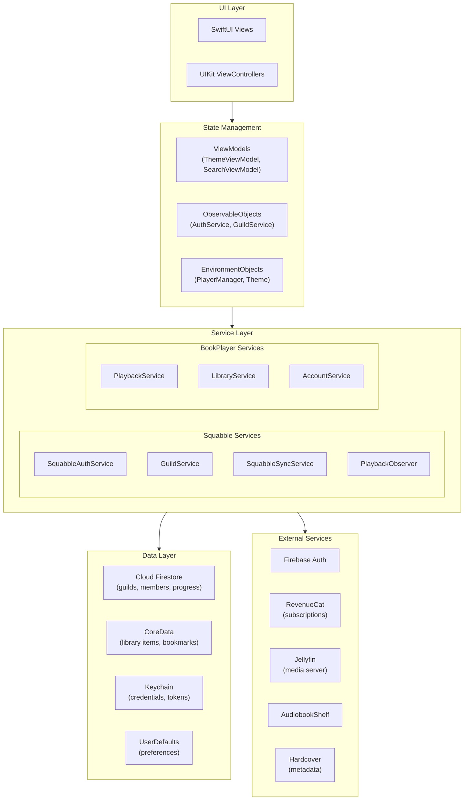
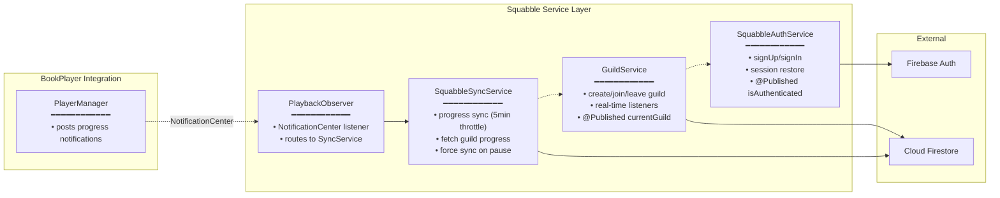
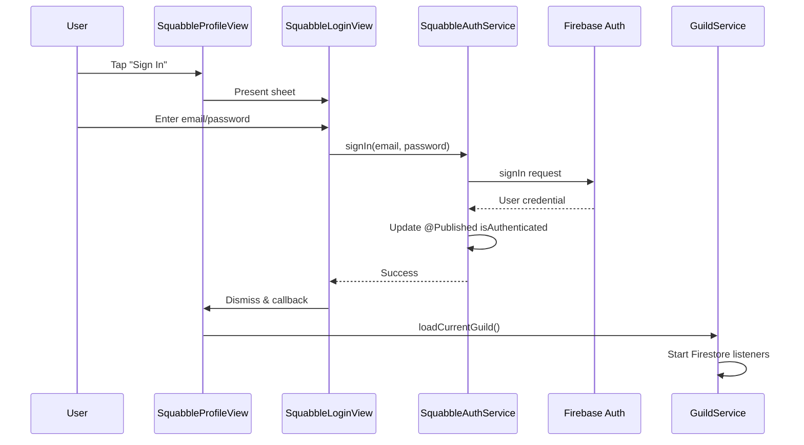
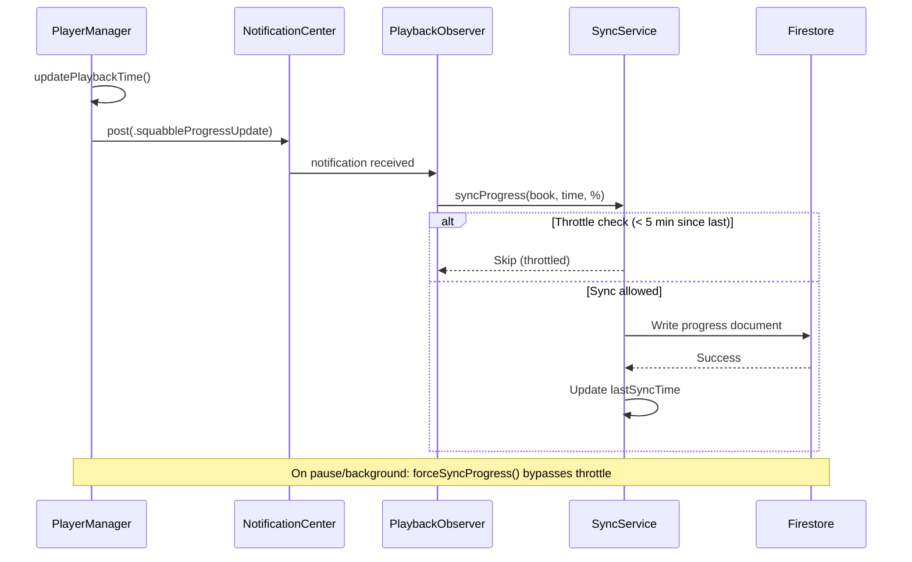
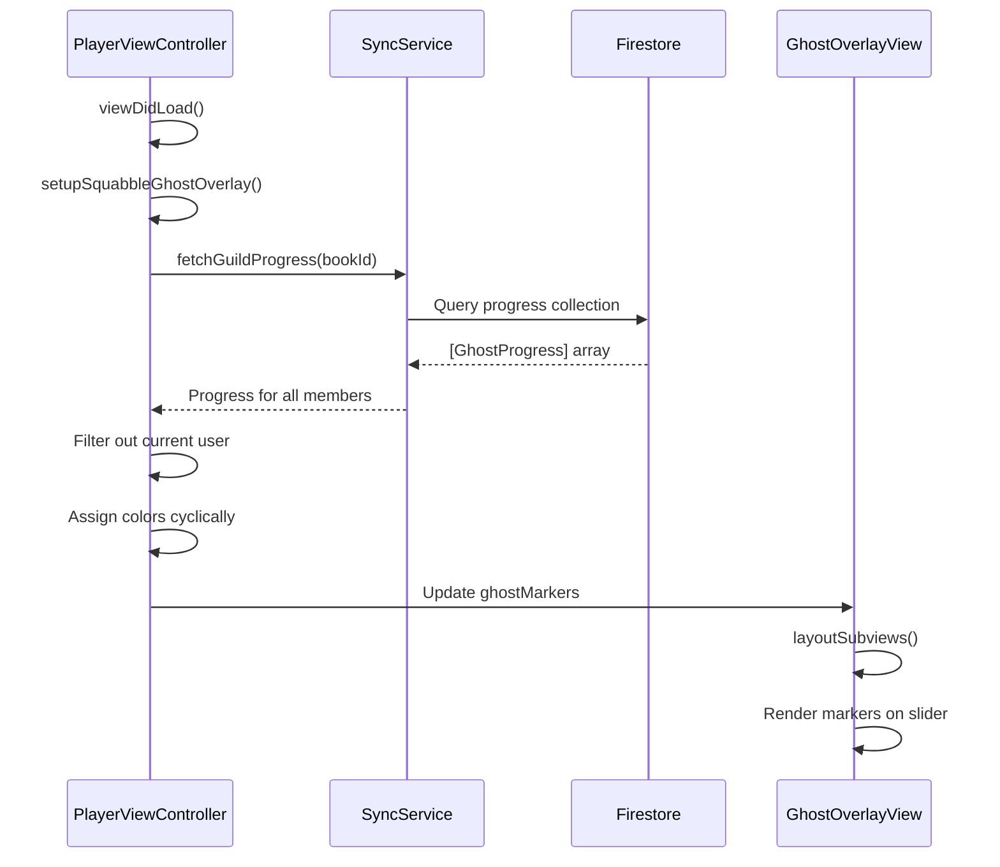
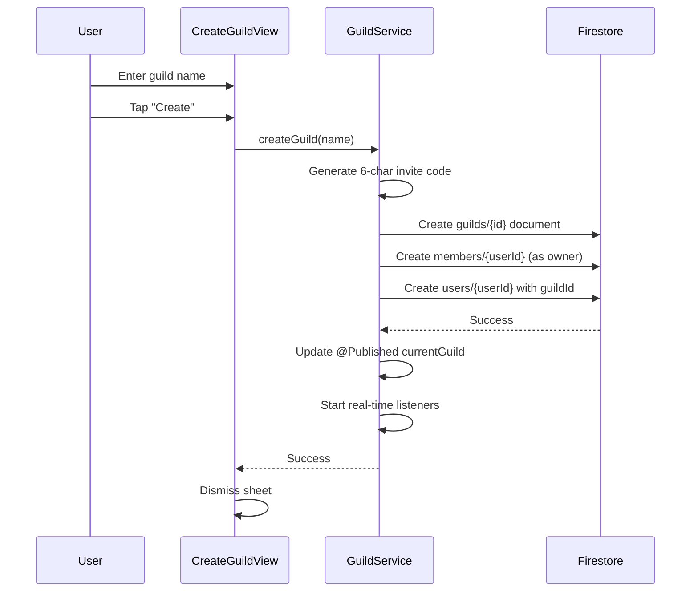
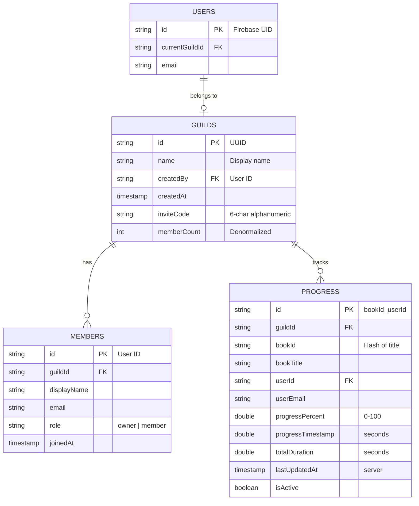
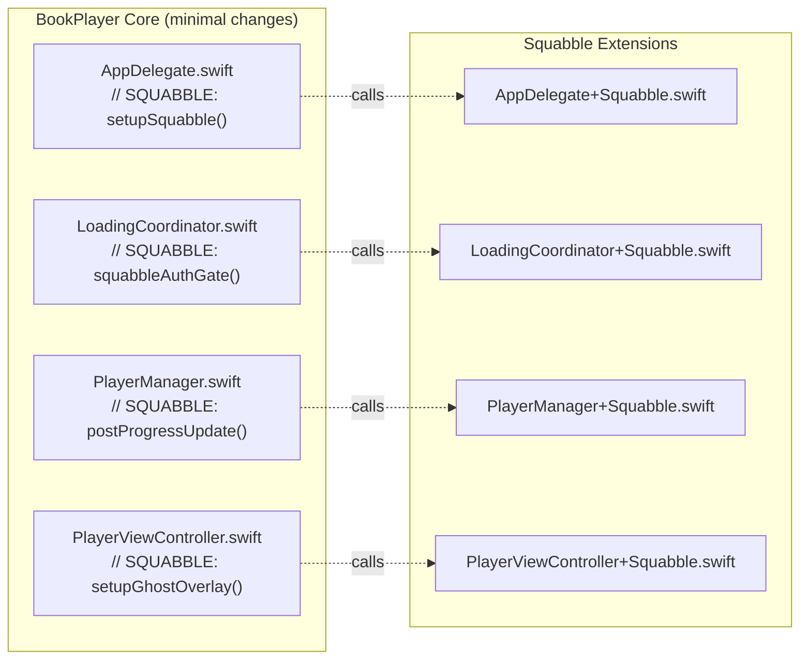

# Squabble Technical Architecture

> Quick technical reference for AI assistants and future development sessions.
> Last updated: December 2025

## Table of Contents
- [System Overview](#system-overview)
- [Service Architecture](#service-architecture)
- [Data Flow Diagrams](#data-flow-diagrams)
- [Firestore Schema](#firestore-schema)
- [Extension Pattern](#extension-pattern)
- [Key Files Reference](#key-files-reference)

---

## System Overview

Squabble is a social audiobook app built as a fork of BookPlayer. It adds guild-based features where friends can see each other's reading progress as "ghost markers" on shared playback timelines.



### Architecture Highlights

| Aspect | Approach |
|--------|----------|
| **UI Framework** | SwiftUI primary, UIKit for complex views (Player) |
| **State Management** | ObservableObject + @Published + Combine |
| **Squabble Integration** | Extension pattern (minimal BookPlayer modifications) |
| **Backend** | Firebase Auth + Cloud Firestore |
| **Local Storage** | CoreData (library), Keychain (secrets), UserDefaults (prefs) |

---

## Service Architecture

### Squabble Services (4 total)



### Service Responsibilities

| Service | Singleton | Observable | Responsibilities |
|---------|-----------|------------|------------------|
| **SquabbleAuthService** | `shared` | Yes | Firebase email/password auth, session management |
| **GuildService** | `shared` | Yes | Guild CRUD, member management, Firestore listeners |
| **SquabbleSyncService** | `shared` | No | Progress sync with 5-min throttle, fetch guild progress |
| **SquabblePlaybackObserver** | `shared` | No | Routes playback notifications to sync service |
| **SquabbleManager** | `shared` | No | Central coordinator, setup and initialization |

### BookPlayer Core Services (used by Squabble)

| Service | Purpose |
|---------|---------|
| **PlayerManager** | Playback state, progress updates, notifications |
| **LibraryService** | Audiobook library management, metadata |
| **DataManager** | CoreData persistence, file system operations |
| **KeychainService** | Secure credential storage |

---

## Data Flow Diagrams

### Authentication Flow



### Progress Sync Flow



### Ghost Markers Display Flow



### Guild Creation Flow



---

## Firestore Schema



### Collection Paths

```
guilds/{guildId}
guilds/{guildId}/members/{userId}
guilds/{guildId}/progress/{bookId_userId}
users/{userId}
```

### Document Examples

**Guild Document:**
```json
{
  "name": "Book Club",
  "createdBy": "user-123",
  "createdAt": "2025-12-10T10:00:00Z",
  "inviteCode": "ABC123",
  "memberCount": 3
}
```

**Member Document:**
```json
{
  "displayName": "John",
  "email": "john@example.com",
  "role": "owner",
  "joinedAt": "2025-12-10T10:00:00Z"
}
```

**Progress Document:**
```json
{
  "bookId": "the-hobbit",
  "bookTitle": "The Hobbit",
  "userId": "user-123",
  "userEmail": "john@example.com",
  "progressPercent": 42.5,
  "progressTimestamp": 3847.2,
  "totalDuration": 9052.0,
  "lastUpdatedAt": "2025-12-13T15:30:00Z",
  "isActive": true
}
```

---

## Extension Pattern

Squabble integrates with BookPlayer using a clean extension pattern that minimizes changes to core files.

### Integration Points (4 files modified)



### Extension File Responsibilities

| Extension | Purpose |
|-----------|---------|
| `AppDelegate+Squabble.swift` | Firebase setup, emulator config, UI test mode |
| `LoadingCoordinator+Squabble.swift` | Auth gate (currently no-op for lazy auth) |
| `PlayerManager+Squabble.swift` | PlaybackObserver + progress notifications |
| `PlayerViewController+Squabble.swift` | Ghost overlay setup and display |

### Benefits of Extension Pattern

1. **Upstream Compatibility** - Easy to merge BookPlayer updates
2. **Isolated Code** - All Squabble code in `/BookPlayer/Squabble/`
3. **Marked Integration** - Search `// SQUABBLE:` to find all hooks
4. **Feature Flags** - `SquabbleConfig.isEnabled` guards all features

---

## Key Files Reference

### Squabble Core

| File | Purpose |
|------|---------|
| `Squabble/Core/SquabbleConfig.swift` | Feature flags, sync intervals, logging |
| `Squabble/Core/SquabbleManager.swift` | Central coordinator, initialization |

### Services

| File | Purpose |
|------|---------|
| `Squabble/Services/SquabbleAuthService.swift` | Firebase Auth wrapper |
| `Squabble/Services/GuildService.swift` | Guild CRUD + Firestore listeners |
| `Squabble/Services/SquabbleSyncService.swift` | Progress sync to Firestore |

### Models

| File | Purpose |
|------|---------|
| `Squabble/Models/Guild.swift` | Guild, GuildMember, GuildRole |
| `Squabble/Models/GhostMarker.swift` | GhostMarker, GhostProgress |

### Views

| File | Purpose |
|------|---------|
| `Squabble/Views/SquabbleProfileView.swift` | Profile tab replacement (guild hub) |
| `Squabble/Views/SquabbleLoginView.swift` | Email/password auth UI |
| `Squabble/Views/GuildView.swift` | Create/Join/Detail views |
| `Squabble/Views/SquabbleGhostOverlayView.swift` | Ghost markers on player |

### Extensions

| File | Purpose |
|------|---------|
| `Squabble/Extensions/AppDelegate+Squabble.swift` | Firebase setup, test mode |
| `Squabble/Extensions/PlayerManager+Squabble.swift` | PlaybackObserver |
| `Squabble/Extensions/PlayerViewController+Squabble.swift` | Ghost overlay |

### Testing

| File | Purpose |
|------|---------|
| `BookPlayerUITests/ScreenshotTests.swift` | 28 automated screenshots |
| `BookPlayerUITests/FirebaseIntegrationTests.swift` | Emulator test base class |
| `BookPlayerUITests/AuthFlowIntegrationTests.swift` | Auth flow tests |
| `BookPlayerUITests/GuildFlowIntegrationTests.swift` | Guild CRUD tests |

### Configuration

| File | Purpose |
|------|---------|
| `firebase.json` | Emulator configuration |
| `firestore.rules` | Security rules |
| `.firebaserc` | Project ID reference |

---

## Quick Commands

```bash
# Start Firebase emulators
firebase emulators:start --only auth,firestore

# Run screenshot tests
./scripts/capture-screenshots.sh

# Run integration tests (requires emulators)
xcodebuild test -scheme BookPlayer -only-testing:BookPlayerUITests/AuthFlowIntegrationTests
```

---

## See Also

- [USER-JOURNEYS.md](./USER-JOURNEYS.md) - All user flows and interactions
- [ROADMAP.md](./ROADMAP.md) - Planned features with acceptance criteria
- [SCREEN-INVENTORY.md](./SCREEN-INVENTORY.md) - Complete screen reference
- [SQUABBLE-HANDOFF.md](../SQUABBLE-HANDOFF.md) - Quick-start reference
